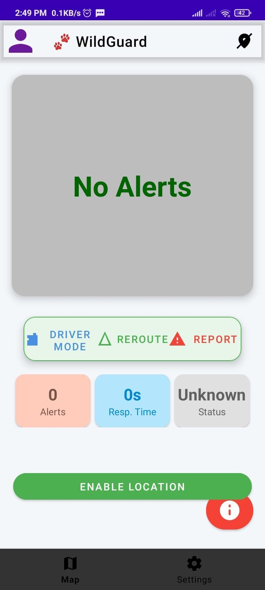
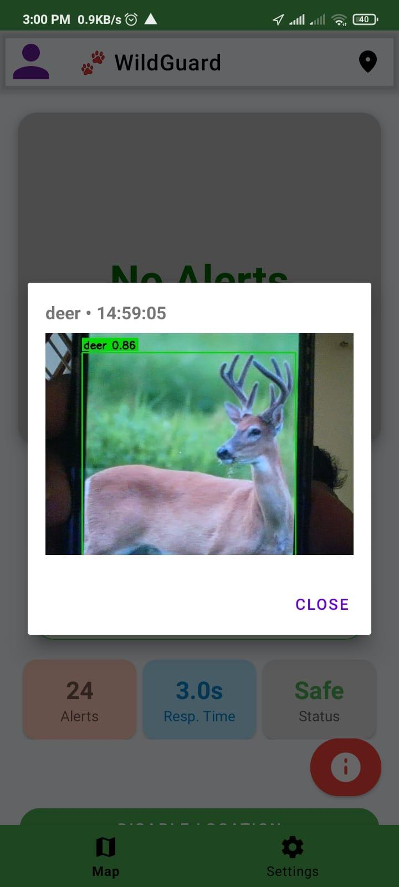
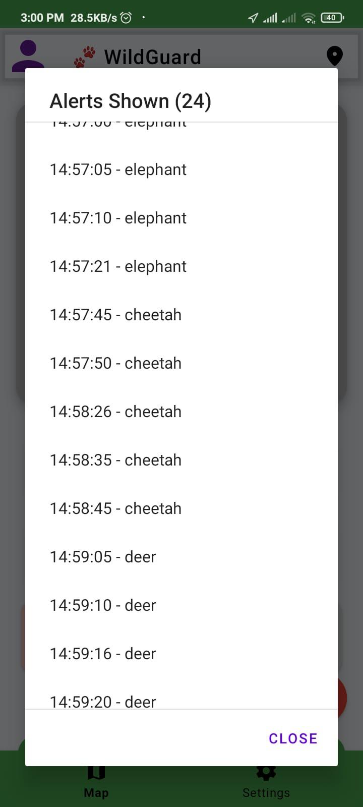
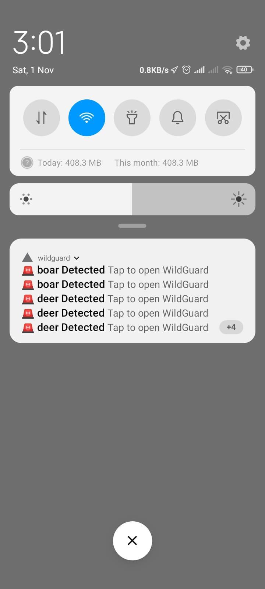
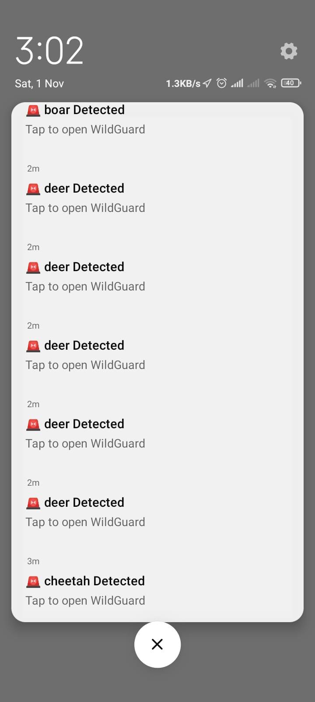
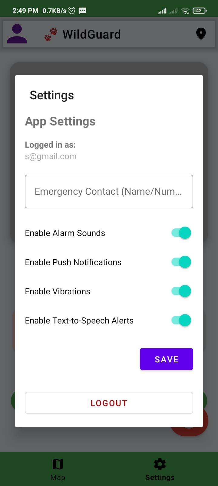

# WildGuard – Smart Wild Animal Alert System 🐘🚦

WildGuard is an AI-powered real-time wild animal detection and alert system 
designed to prevent road accidents in forest and wildlife-prone areas.

## 🚀 Features
- Real-time animal detection using YOLOv8
- Snapshot + timestamp generation
- Firebase backend integration
- GPS-based alerts within 1 km radius
- Android app with voice & notification alerts

## 🛠 Tech Stack
- Python, YOLOv8, OpenCV
- Firebase (Firestore, Cloud Messaging)
- Android (Kotlin)
- Google Maps API

## 📷 System Flow
Camera → YOLOv8 Detection → Firebase → Android App → User Alert

## 🎯 Impact
Reduces manual monitoring and improves alert response time to under 5 seconds.

## 📸 Project Screenshots

### 🏠 Home Screen

  

### 🧠 YOLOv8 Detection (Terminal)

  

### 📊 Dashboard

  

### 📊 Dashboard (Alternate View)

  

### 🚨 Alert Screen

  

### 🚨 Alert Screen (Detailed View)

  

### 🔔 Notifications

  

### 🔔 Notifications 

  

### 🗺 Map View

  

### ⚙ Settings Screen

  

